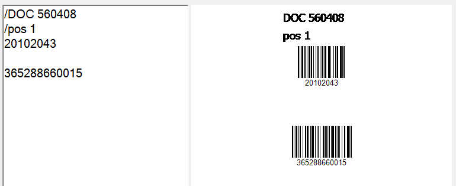

# Generator-CODE-128

  
  

Simple Windows Forms program for generating CODE-128 barcodes. 

## How to use:
* In left field write every code in separate line
* If you need labels, write them with '/' in front of label text
* Empty lines will produce some space between codes
* Pressing TAB twice will generate codes

Example:

  

